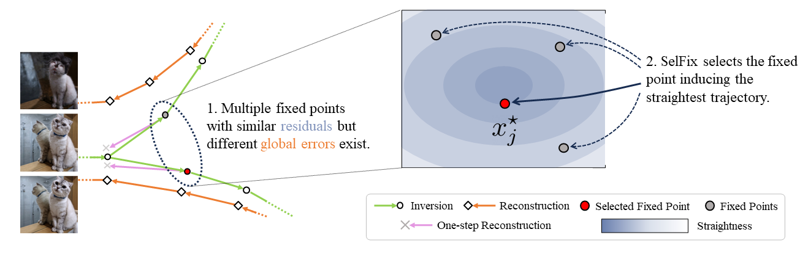

# SelFix: Root-Selecting Fixed-Point Inversion for Rectified Flows via Trajectory Straightness

[](https://arxiv.org/abs/2606.00000)

This repository contains the code for SelFix: Root-Selecting Fixed-Point Inversion for Rectified Flows via Trajectory Straightness.
SelFix is a fixed-point inversion method that selects an inversion trajectory to be as straight as possible, improving rectified-flow inversion.

The release includes the PIE-Bench reconstruction and editing runner, paper configs, baseline method switches, and per-sample metric logging.
This repository builds on [FireFlow](https://github.com/HolmesShuan/FireFlow-Fast-Inversion-of-Rectified-Flow-for-Image-Semantic-Editing), with additional fixed-point baselines and PIE-Bench evaluation.

<p align="center">
  
</p>

## Installation

The codebase is developed and tested with `PyTorch 2.7.1` and CUDA 12.6.
We recommend the official [`pytorch/pytorch:2.7.1-cuda12.6-cudnn9-devel`](https://hub.docker.com/layers/pytorch/pytorch/2.7.1-cuda12.6-cudnn9-devel) Docker image.

Start a container from the image:

```shell
docker run --gpus all --ipc=host -it --rm \
  -v "$PWD":/workspace \
  pytorch/pytorch:2.7.1-cuda12.6-cudnn9-devel bash
```

Then install SelFix inside the container:

```shell
cd /workspace
git clone https://github.com/SeminKim/selfix-inversion
cd selfix-inversion
python -m pip install --upgrade pip setuptools wheel
python -m pip install -e .
```

FLUX.1-dev weights are downloaded from Hugging Face on first use. Make sure your Hugging Face account has access to the gated FLUX.1-dev model, then authenticate inside the container:

```shell
huggingface-cli login
```

## Data Preparation

Download PIE-Bench from [PnPInversion](https://github.com/cure-lab/PnPInversion).
Place PIE-Bench under `.data` so these paths exist:

```text
.data/mapping_file.json
.data/annotation_images/
```

## Public Methods

The public runner supports:

```text
selfix, fpi, reflow, rf_solver, fireflow, renoise, aidi_e
```

`selfix` is the paper method: fixed-point inversion with the SelFix straightness anchor and harmonic alpha schedule. `fpi` uses the same fixed-point inversion loop without the SelFix anchor; momentum is disabled internally for this naive fixed-point baseline.

The SelFix alpha schedule is:

```python
alpha = alpha1 * delta / (k + delta)
```

The implementation uses zero-based inner-loop indexing, so `k=0` is the first fixed-point iteration.

## Running SelFix

Reconstruction:

```shell
python src/run_pie_bench.py \
  --task reconstruction \
  --config configs/pie_reconstruction_selfix.yaml \
  --start_idx 0 \
  --end_idx 699
```

Editing:

```shell
python src/run_pie_bench.py \
  --task editing \
  --config configs/pie_editing_selfix.yaml \
  --start_idx 0 \
  --end_idx 699
```

Outputs are written under the config `output.root`, including:

```text
resolved_config.json
summary.json
results/*.json
images/*.jpg
features/
trajectories/   # reconstruction
latents/        # reconstruction
```

Use `--skip_existing` to resume an interrupted run. Use `--save_trace` to write detailed fixed-point trace JSON files.

## Running NFE-Matched Baselines

Use the same runner and override the public method and step fields from the command line.

Reconstruction NFE budget:

| Method | Command overrides | Total NFE |
| --- | --- | ---: |
| SelFix | default reconstruction config | 165 |
| FPI | `--method fpi --momentum 0` | 165 |
| ReFlow | `--method reflow --num_steps 83` | 166 |
| RF-Solver | `--method rf_solver --num_steps 42` | 168 |
| FireFlow | `--method fireflow --num_steps 83` | 168 |

Editing NFE budget:

| Method | Command overrides | Total NFE |
| --- | --- | ---: |
| SelFix | default editing config | 75 |
| FPI | `--method fpi --momentum 0` | 75 |
| ReFlow | `--method reflow --num_steps 38` | 76 |
| RF-Solver | `--method rf_solver --num_steps 19` | 76 |
| FireFlow | `--method fireflow --num_steps 38` | 78 |

Example baseline run:

```shell
python src/run_pie_bench.py \
  --task reconstruction \
  --config configs/pie_reconstruction_selfix.yaml \
  --method reflow \
  --num_steps 83 \
  --output_root runs/reconstruction_reflow_nfe166 \
  --start_idx 0 \
  --end_idx 699
```

## Sharded Runs

For multiple GPUs, launch one process per shard and give each process one visible GPU. All shards may share the same `--output_root`.

```shell
CUDA_VISIBLE_DEVICES=0 python src/run_pie_bench.py \
  --task reconstruction --config configs/pie_reconstruction_selfix.yaml \
  --output_root runs/reconstruction_selfix \
  --num_shards 2 --shard_index 0 --start_idx 0 --end_idx 699 &

CUDA_VISIBLE_DEVICES=1 python src/run_pie_bench.py \
  --task reconstruction --config configs/pie_reconstruction_selfix.yaml \
  --output_root runs/reconstruction_selfix \
  --num_shards 2 --shard_index 1 --start_idx 0 --end_idx 699 &

wait
```

Each process writes per-sample JSON files. The final `summary.json` is produced by the shard that exits last, so check that `summary.json` reports the expected number of results.

If a first-time sharded run fails while downloading `facebookresearch/dino` from `torch.hub`, run one shard once or prewarm the Torch Hub cache before launching all shards in parallel.

## Acknowledgements

This code builds on FireFlow and FLUX.
We sincerely appreciate the release of these projects.

## How to Cite
If you find this work helpful, please cite:

```bibtex
@misc{kim2026rootselecting,
      title={Root-Selecting Fixed-Point Inversion for Rectified Flows via Trajectory Straightness},
      author={Semin Kim and Jihwan Yoon and Seunghoon Hong},
      year={2026},
      eprint={2606.00000},
      archivePrefix={arXiv},
      primaryClass={cs.CV},
      url={https://arxiv.org/abs/2604.00000},
}
```
